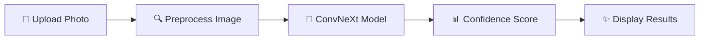

<div align="center">

# 🐕 DoggyDex
### *The Ultimate Dog Breed Identification Experience*

[](https://python.org)
[](https://flask.palletsprojects.com)
[](https://pytorch.org)
[](https://docker.com)

[**🌐 Live Demo**](https://www.josephfoster.me/doggydex) | [**📸 Try It Now**](#getting-started) | [**🤝 Contribute**](#contributing)

---

</div>

## 🎯 What is DoggyDex?

Ever wondered **"What breed is that adorable dog?"** 🤔

DoggyDex is your AI-powered dog breed identification companion that can instantly recognize over **100+ dog breeds** from a single photo! Built with cutting-edge machine learning and a sleek web interface, it's like having a canine expert in your pocket.

<div align="center">

### 🏆 **Powered by ConvNeXt Large** - State-of-the-art computer vision
### 🚀 **Lightning Fast** - Get results in seconds
### 📱 **Mobile Friendly** - Works on any device
### 🎨 **Beautiful UI** - Smooth, modern design

</div>

---

## ✨ Features

<table>
<tr>
<td width="50%">

### 🔍 **Smart Recognition**
- **100+ breed classification**
- **High accuracy detection**
- **Confidence scoring**
- **Multiple dog detection**

### 🎨 **User Experience**
- **Drag & drop upload**
- **Instant results**
- **Mobile responsive**
- **Clean, intuitive design**

</td>
<td width="50%">

### ⚡ **Performance**
- **Optimized models**
- **Fast inference**
- **Quantized weights**
- **Efficient processing**

### 🛠️ **Tech Stack**
- **Flask backend**
- **PyTorch ML models**
- **Docker deployment**
- **SSL/HTTPS ready**

</td>
</tr>
</table>

---

## 🚀 Getting Started

### 🐳 Quick Start with Docker

```bash
# Clone the repository
git clone https://github.com/yourusername/doggydex.git
cd doggydex

# Build and run with Docker
docker build -t doggydex .
docker run -p 5001:5001 doggydex
```

### 🛠️ Local Development

```bash
# Install dependencies with Poetry
poetry install

# Activate virtual environment
poetry shell

# Run the application
python app.py
```

Visit `http://localhost:5001` and start identifying dogs! 🎉

---

## 📋 Requirements

<div align="center">

| Component | Version | Purpose |
|-----------|---------|---------|
| 🐍 **Python** | 3.10+ | Core runtime |
| 🧠 **PyTorch** | Latest | ML inference |
| 🌐 **Flask** | 3.1+ | Web framework |
| 🔧 **Poetry** | Latest | Dependency management |

</div>

---

## 🏗️ Project Structure

```
doggydex/
├── 🐍 app.py                 # Application entry point
├── 🔧 pyproject.toml         # Project configuration
├── 🐳 Dockerfile             # Container configuration
├── 🧠 models/                # ML model files
│   ├── dognet-convnext_large.pth
│   └── dognext_large_quantized.pth
├── 🌐 website/               # Web application
│   ├── 🎨 static/           # CSS, JS, images
│   ├── 📄 templates/        # HTML templates
│   ├── 🔍 identifier.py     # ML inference logic
│   └── 🎯 views.py          # Route handlers
└── 🔐 certs/                # SSL certificates
```

---

## 🎨 Screenshots

<div align="center">

### 🏠 **Home Page**
*Clean, modern interface ready for your dog photos*

### 🔍 **Results Page**
*Instant breed identification with confidence scores*

### 📱 **Mobile View**
*Fully responsive design for on-the-go identification*

</div>

---

## 🤖 How It Works

<div align="center">



</div>

1. **📸 Upload** - Take or select your dog photo
2. **🔍 Process** - Image preprocessing and normalization
3. **🧠 Analyze** - ConvNeXt Large model inference
4. **📊 Score** - Confidence percentage calculation
5. **✨ Results** - Beautiful breed identification display

---

## 🌟 Why DoggyDex?

<div align="center">

### 💡 **"Because every dog deserves to be recognized!"**

</div>

- **🎯 Accurate**: Trained on thousands of dog images
- **⚡ Fast**: Optimized for real-time inference  
- **🎨 Beautiful**: Modern, responsive design
- **🔒 Secure**: HTTPS-ready with SSL support
- **🐳 Scalable**: Docker containerization
- **🆓 Free**: Open source and free to use

---

## 🤝 Contributing

We love contributions! 💖

<div align="center">

[](https://github.com/yourusername/doggydex/issues)
[](https://github.com/yourusername/doggydex/network)
[](https://github.com/yourusername/doggydex/stargazers)

</div>

### 🎯 Ways to Contribute:
- 🐛 **Report bugs** - Help us improve
- ✨ **Suggest features** - Share your ideas  
- 📝 **Improve docs** - Make it clearer
- 🧠 **Train models** - Better accuracy
- 🎨 **Design UI** - Enhanced experience

---

## 📄 License

This project is licensed under the **MIT License** - see the [LICENSE](LICENSE) file for details.

---

<div align="center">

### 🐕 **Happy Dog Identifying!** 🐕

**Made with ❤️ by [Joe Foster](mailto:josephrfoster@protonmail.com)**

[](https://josephfoster.me)

---

*⭐ Star this repo if you found it helpful!*

</div>